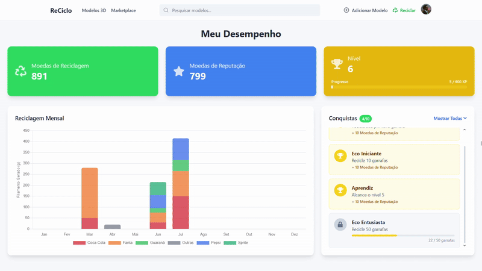
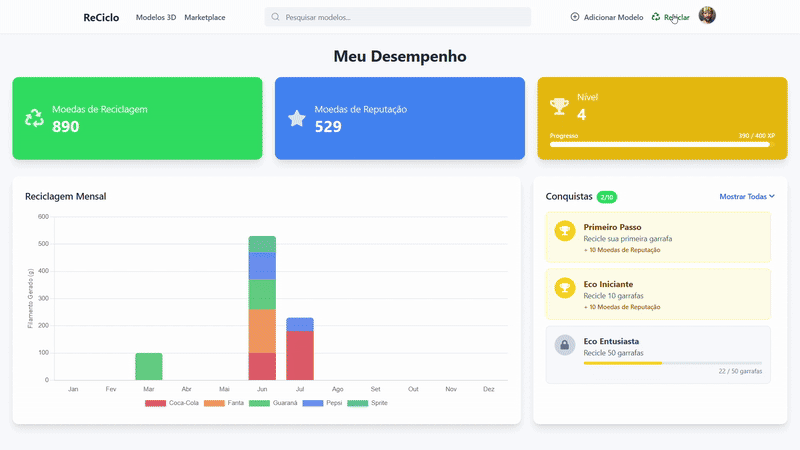
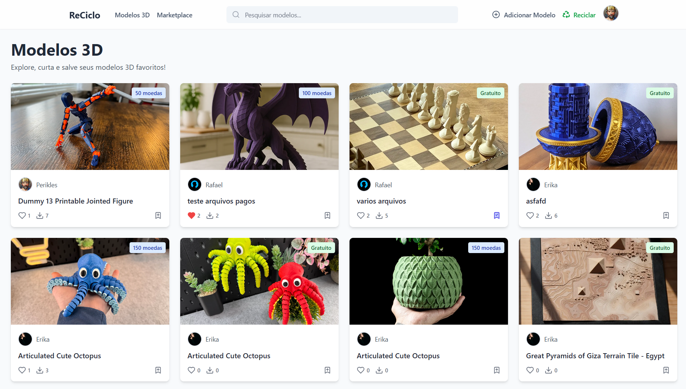
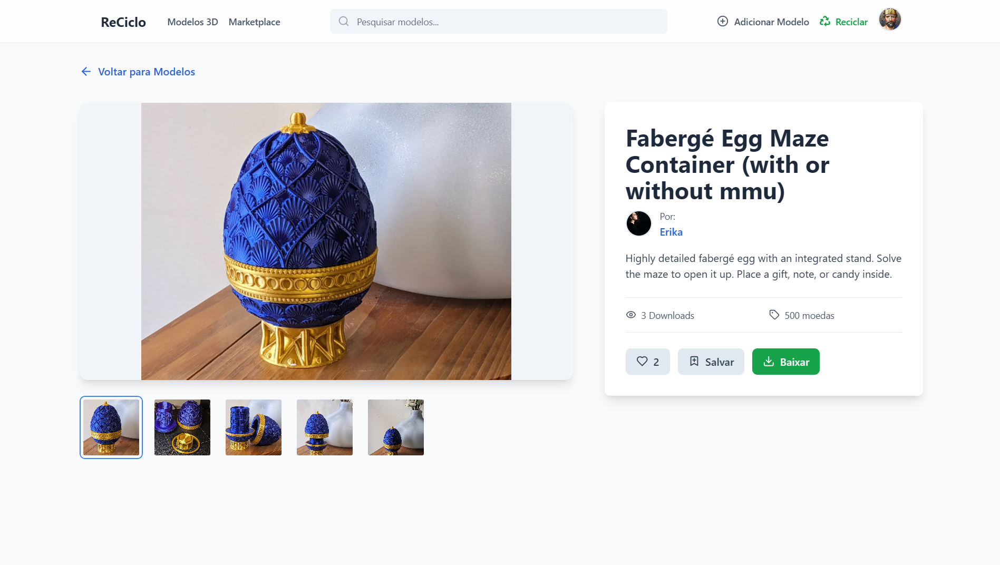
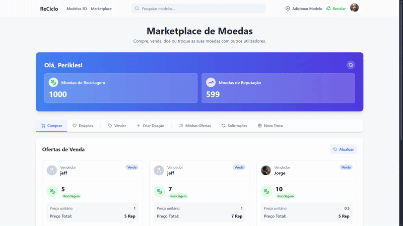
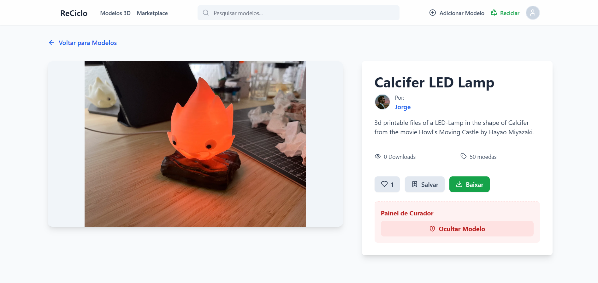

# ReCiclo: Plataforma de Reciclagem Gamificada

**ReCiclo** é uma plataforma digital desenvolvida como Trabalho de Conclusão de Curso que aplica os princípios da **economia circular** para conectar o descarte de garrafas PET à demanda por filamentos na **manufatura aditiva (impressão 3D)**. Através da **gamificação**, o projeto transforma a reciclagem numa atividade engajadora e recompensadora, criando um ecossistema digital onde resíduos se transformam em recursos.

---

## 📜 Índice

- [Sobre o Projeto](#sobre-o-projeto)
- [Tecnologias Utilizadas](#tecnologias-utilizadas)
- [Funcionalidades Principais](#funcionalidades-principais)
- [Como Executar o Projeto](#como-executar-o-projeto)
- [Como Usar o Projeto](#como-usar-o-projeto)
  - [Dashboard do Usuário](#dashboard-do-usuário)
  - [Reciclagem e Recompensas](#reciclagem-e-recompensas)
  - [Catálogo de Modelos 3D](#catálogo-de-modelos-3d)
  - [Marketplace](#marketplace)
  - [Gerenciamento de Perfil](#gerenciamento-de-perfil)
- [Autoria](#autoria)

---

## Sobre o Projeto

Este projeto apresenta a "ReCiclo", uma plataforma web desenvolvida para enfrentar o desafio ambiental da poluição por plástico PET, criando um ecossistema de reciclagem funcional e engajador. A aplicação serve como uma ponte entre os consumidores que desejam reciclar garrafas PET e o crescente mercado de impressão 3D, proporcionando filamentos acessíveis e sustentáveis.

Através de um sistema gamificado, os usuários são incentivados a reciclar garrafas PET em troca de moedas virtuais e recompensas, transformando um senso de dever em uma experiência engajadora. A plataforma conta com um catálogo colaborativo para o compartilhamento de modelos 3D e um marketplace interno, validando um modelo viável para a aplicação dos princípios da economia circular de forma prática.

###

---

## Tecnologias Utilizadas

O projeto foi construído com uma arquitetura de três camadas, utilizando as seguintes tecnologias:

- **Frontend:**

  - React 19.1.0
  - Axios 1.7.9
  - Tailwind CSS 3.2.0

- **Backend:**

  - Python 3.12
  - Django 5.1.1
  - Django REST Framework (DRF)
  - dj-rest-auth

- **Banco de Dados:**
  - SQLite (para desenvolvimento)

---

## Funcionalidades Principais

- **Gamificação Completa:**

  - Sistema de **Níveis e Experiência (XP)** que progride com as ações do utilizador.
  - **Conquistas** desbloqueáveis com base em metas de reciclagem e participação.
  - **Notificações em tempo real** para eventos como "Level Up".

- **Economia Interna com Duas Moedas:**

  - **Moedas de Reciclagem:** Obtidas ao reciclar, usadas para comprar modelos 3D.
  - **Moedas de Reputação:** Obtidas ao participar na plataforma, usadas para comprar Moedas de Reciclagem de outros usuários.

- **Marketplace de Moedas Completo:**

  - Abas separadas para **Comprar**, **Vender** e **Doar** Moedas de Reciclagem.
  - Sistema de **Trocas Diretas** entre utilizadores com propostas detalhadas.
  - Painel para gerir ofertas e solicitações de troca.

- **Catálogo de Modelos 3D:**

  - Grid de modelos com pesquisa.
  - Página de detalhes com galeria de imagens, sistema de **Likes** e **Favoritos**.
  - Funcionalidade de **download** dos modelos 3D, com lógica de pagamento com moedas.

- **Gestão de Utilizadores e Conteúdo:**
  - **Perfis Públicos** para cada utilizador, mostrando os seus modelos.
  - **Página de Gestão de Perfil** com CRUD para os próprios modelos.
  - **Sistema de Curadoria** que permite a moderadores ocultar conteúdo inadequado.

---

## Como Executar o Projeto

Para executar este projeto localmente, você precisará de ter o Python, Node.js e npm instalados.

1.  **Clone o repositório:**

    ```bash
    git clone https://github.com/Valentim-dg/ReCiclo.git
    ```

### Configuração do Backend (Django)

1.  **Crie e ative um ambiente virtual: (no terminal do controller)**

    ```bash
    # No Windows
    python -m venv venv
    .\venv\Scripts\activate

    # No macOS/Linux
    python3 -m venv venv
    source venv/bin/activate
    ```

2.  **Instale as dependências:**

    ```bash
    pip install -r requirements.txt
    ```

3.  **Execute as migrações do banco de dados:**

    ```bash
    python manage.py makemigrations
    python manage.py migrate
    ```

4.  **Crie um superutilizador (para aceder ao painel de admin):**

    ```bash
    python manage.py createsuperuser
    ```

5.  **Inicie o servidor do backend:**
    ```bash
    python manage.py runserver
    ```
    O servidor estará rodando em `http://127.0.0.1:8000`.

### Configuração do Frontend (React)

1.  **Abra um novo terminal e navegue até a pasta do frontend:**

    ```bash
    cd Reciclo/frontend
    ```

2.  **Instale as dependências:**

    ```bash
    npm install
    ```

3.  **Inicie o servidor de desenvolvimento:**
    ```bash
    npm start
    ```
    A aplicação React estará disponível em `http://localhost:3000`.

---

## Como Usar o Projeto

### Dashboard do Usuário

Após o login, o usuário poderá acessar seu painel pessoal, que funciona como o centro de controle principal. Ele fornece um feedback visual imediato sobre o progresso e o engajamento.

- **Métricas:** As principais métricas, como "Moedas de Reciclagem", "Moedas de Reputação" e o nível atual do usuário, são exibidas de forma proeminente.

- **Gráfico de Reciclagem:** Um gráfico mensal visualiza a quantidade de filamento gerado a partir de garrafas recicladas.

- **Conquistas:** Um painel interativo mostra as conquistas desbloqueadas e destaca as próximas a serem alcançadas para incentivar a participação contínua.



---

### Reciclagem e Recompensas

A funcionalidade central da plataforma é o processo de reciclagem. Os usuários podem registrar o tipo, volume e quantidade de garrafas recicladas através de um formulário intuitivo. O sistema então, automaticamente:

1. Calcula e concede as moedas virtuais correspondentes.

2. Adiciona pontos de experiência, verifica se o usuário subiu de nível e atualiza o histórico do usuário.

3. Exibe uma notificação de celebração se uma nova conquista for desbloqueada.



---

### Catálogo de Modelos 3D

A página inicial da plataforma funciona como uma vitrine para os modelos 3D compartilhados pela comunidade. Os usuários podem navegar e pesquisar os modelos.



Ao clicar em um modelo, os usuários podem ver informações detalhadas, uma galeria de imagens completa e adquirir os arquivos do modelo, seja gratuitamente ou usando suas "Moedas de Reciclagem".



---

### Marketplace

O Marketplace é o centro econômico da plataforma, onde os usuários podem negociar suas moedas virtuais. Ele é organizado em várias abas funcionais:

- **Comprar e Vender:** Usuários podem comprar "Moedas de Reciclagem" de outros membros usando suas "Moedas de Reputação" ou criar ofertas para vender as suas próprias.

- **Doações:** Uma seção dedicada permite que os usuários ofereçam ou recebam "Moedas de Reciclagem" gratuitamente.

- **Gestão de Ofertas:** Os usuários têm uma área centralizada para gerenciar suas ofertas ativas, solicitações e histórico de trocas.



### Gerenciamento de Perfil

Na página de perfil, os usuários podem atualizar suas informações pessoais e gerenciar os modelos 3D que eles mesmos publicaram, com funcionalidades completas de CRUD (Criar, Ler, Atualizar, Apagar).

Figura 6: Página de Gerenciamento de Perfil


Além disso, usuários com permissão de "curador" têm acesso a um painel de moderação especial nas páginas de detalhes dos modelos, permitindo-lhes ocultar conteúdo inadequado para manter a integridade da plataforma.



---

## Autoria

Este projeto foi desenvolvido por **Valentim D. Garcia** como Trabalho de Conclusão de Curso para o curso de Tecnologias em Análise e Desenvolvimento de Sistemas no **Instituto Federal Sul-rio-grandense (IFSul) - Campus Santana do Livramento**.

**Orientador:** Prof. Alfredo P. Gomes
